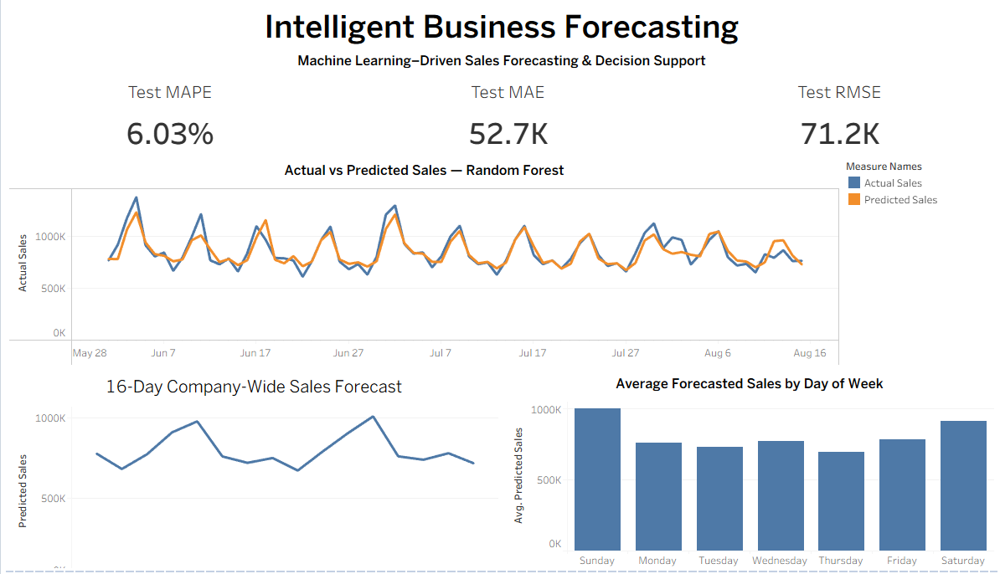
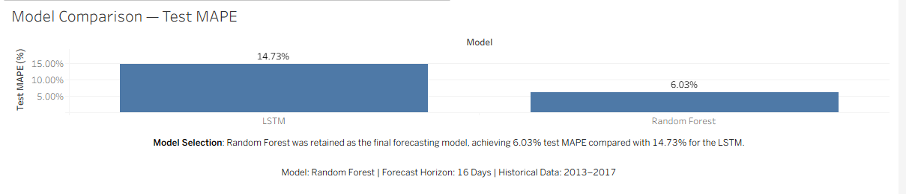
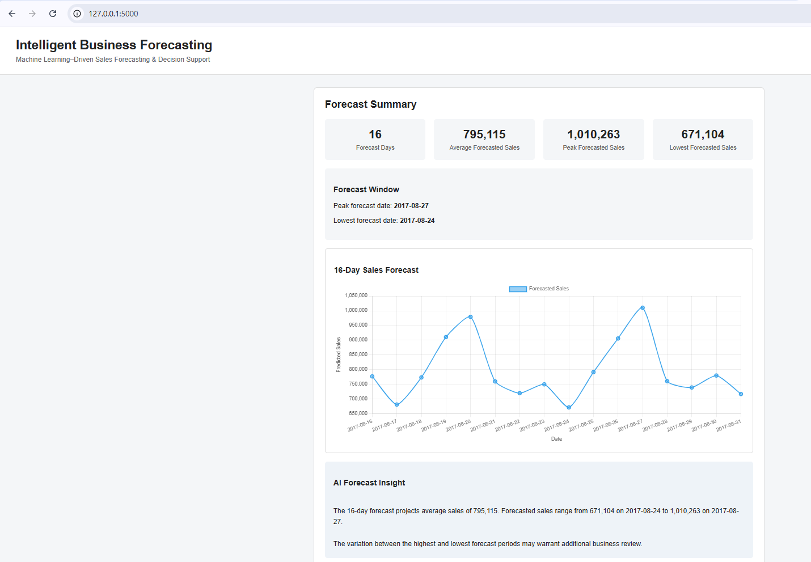
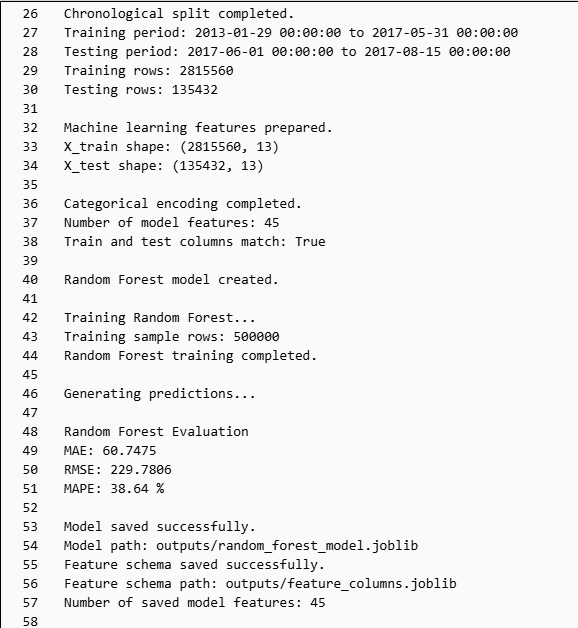
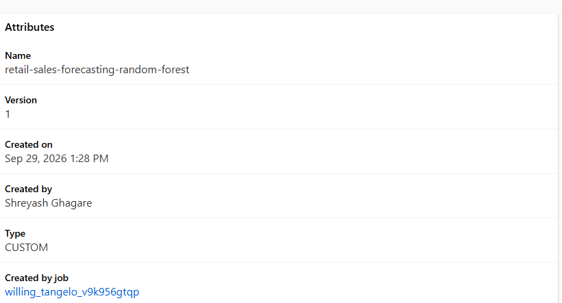
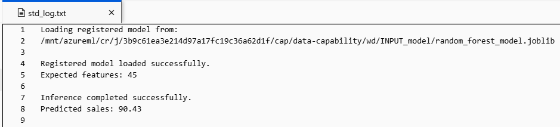

# Intelligent Business Forecasting

I built this project to explore how historical sales data can be turned into a practical forecasting tool for business planning.

The project uses historical retail sales to build and evaluate forecasting models, generate future sales forecasts, and present the results through a Tableau dashboard and Flask application. I also tested an LSTM neural network to see whether a deep learning approach could improve on the traditional machine learning model.

### Live Dashboard

View the interactive Tableau dashboard:

[Intelligent Business Forecasting Dashboard](https://public.tableau.com/app/profile/shreyash.ghagare/viz/Intelligent_Business_Forecasting/Dashboard1?publish=yes)

## Business Problem

Businesses need reliable sales forecasts for decisions such as inventory planning, staffing, budgeting, and resource allocation.

The goal of this project was not simply to build the most complex forecasting model. I wanted to answer three practical questions:

- Can historical sales patterns be used to predict future sales with reasonable accuracy?
- Does an LSTM neural network improve forecasting performance compared with a traditional machine learning model?
- How can the forecast be presented in a way that is useful for business users?

The final solution combines model development, model comparison, future forecasting, visualization, and an AI-assisted explanation layer

## Dataset

The project uses the Store Sales - Time Series Forecasting dataset, which contains historical retail sales from multiple stores and product families.

The available data includes:

- Daily sales
- Store information
- Product families
- Transactions
- Holidays and events
- Oil prices

For the forecasting model used in this project, sales were aggregated to the daily level to create a company-wide sales time series.

The main `train.csv` file is not included in this repository because of its size. The original dataset can be downloaded from Kaggle's Store Sales - Time Series Forecasting competition.

## Forecasting Approach

I used a chronological split rather than randomly shuffling the observations because future information should not be used to predict the past in a time-series problem.

The workflow included:

- Loading and cleaning the historical sales data
- Aggregating sales by date
- Creating calendar and historical sales features
- Separating training, validation, and test periods chronologically
- Training a Random Forest forecasting model
- Evaluating forecasts using MAE, RMSE, and MAPE
- Generating a future 16-day sales forecast
- Testing an LSTM as a deep learning alternative

The final held-out test period contained **76 days from June 1 to August 15, 2017**.

## Random Forest vs LSTM

After building the Random Forest model, I wanted to test whether a sequence-based deep learning model could improve the forecast.

I trained an LSTM using the previous **30 days of sales** to predict the next day's sales. The sales values were scaled using a MinMaxScaler fitted only on the training period to avoid leaking information from the validation or test periods.

The LSTM used:

- 30-day input sequences
- 32-unit LSTM layer
- 16-neuron dense layer with ReLU activation
- Adam optimizer
- Mean squared error loss
- Early stopping based on validation loss

Both models were evaluated on the same 76-day held-out test period.

| Model | Test MAE | Test RMSE | Test MAPE |
| --- | ---: | ---: | ---: |
| Random Forest | **52,725.61** | **71,211.87** | **6.03%** |
| LSTM | 130,618.44 | 167,681.32 | 14.73% |

The LSTM captured the general level of sales but produced smoother predictions and missed many of the short-term peaks and declines in the series.

Random Forest performed better across all three test metrics, so I retained it as the final forecasting model. This experiment was a useful reminder that a more complex deep learning model does not automatically produce a better forecast.

## Future Sales Forecast

After selecting Random Forest as the final model, I used it to generate a **16-day future sales forecast**.

The forecast output is saved in:

`data/processed/future_sales_forecast.csv`

The project also saves predictions from the held-out test period so that actual and predicted sales can be compared directly.

## Tableau Dashboard

I built a Tableau dashboard to make the forecasting results easier to interpret without having to work directly with the Python notebook.

The dashboard includes:

- Test MAE, RMSE, and MAPE
- Actual vs predicted sales
- Daily future sales forecast
- Cumulative forecast
- Random Forest vs LSTM model comparison
- Final model-selection decision

The final Random Forest model achieved a **6.03% MAPE** on the 76-day held-out test period.

The packaged Tableau workbook is available in the `Tableau/` directory.

### Forecasting Dashboard



### Random Forest vs LSTM



## Flask Application

I also built a Flask application around the forecasting workflow.

The application allows the forecasting results to be accessed through a simple web interface rather than requiring a user to run the notebook directly.

The Flask code is available in:

`src/app.py`

### Application Example



## AI-Generated Business Explanation

The application includes a local **Llama 3.2** model through Ollama to turn forecast results into a short natural-language explanation.

The LLM is used as an explanation layer rather than as the forecasting model itself.

The workflow is:

Forecasting Model  
↓  
Sales Forecast  
↓  
Forecast Summary  
↓  
Llama 3.2 via Ollama  
↓  
Business-Friendly Explanation

This separation is intentional: Random Forest generates the numerical forecast, while the LLM helps communicate the result in plain language.

## Azure Machine Learning Extension

I extended the original forecasting project into Azure Machine Learning to practice a cloud-based machine learning workflow and model lifecycle.

Instead of training and managing the model only in a local notebook, this implementation uses Azure ML for data access, reproducible training jobs, experiment tracking, model registration, and inference.

### Azure ML Workflow

The cloud workflow is:

Azure Blob Storage  
↓  
Azure ML Data Asset  
↓  
Azure ML Compute  
↓  
Feature Engineering  
↓  
Chronological Train/Test Split  
↓  
Random Forest Training Job  
↓  
Model Evaluation  
↓  
Model Registration  
↓  
Registered Model Inference

The Azure implementation works with the original store-and-product-family level data rather than the company-wide daily aggregation used in the original forecasting experiment.

### Feature Engineering

The Azure ML model uses:

- Store number
- Product family
- Promotion information
- Calendar features
- Sales lag features: 1, 7, 14, and 28 days
- Rolling sales averages: 7 and 28 days

Product family is one-hot encoded before model training. After encoding, the Random Forest uses 45 model features.

To prevent time-series leakage, lag and rolling features are calculated using only previous sales observations.

### Chronological Evaluation

The data is divided chronologically rather than randomly.

- Training period: January 29, 2013 to May 31, 2017
- Test period: June 1, 2017 to August 15, 2017
- Test horizon: 76 days
- Random Forest training sample: 500,000 rows

The Azure ML Random Forest achieved:

| Metric | Result |
| --- | ---: |
| MAE | 60.7475 |
| RMSE | 229.7806 |
| MAPE | 38.64% |

These metrics should not be compared directly with the 6.03% MAPE from the original company-wide forecasting model because the Azure implementation predicts at the more granular store/product-family level.

### Azure ML Training

The training workflow runs as an Azure ML command job using a managed Scikit-learn environment.

The training script performs feature engineering, chronological splitting, categorical encoding, Random Forest training, evaluation, and model artifact generation.



### Model Registration

After successful training, the Random Forest model was saved as a job artifact and registered in the Azure ML model registry as a versioned model.



### Registered Model Inference

I also created a separate inference job that loads the registered model and executes a prediction using the same Azure ML Scikit-learn environment used for training.

During local notebook testing, the model artifact produced a Scikit-learn version warning because the notebook environment differed from the training environment. Instead of ignoring the warning, inference was moved to the matching Azure ML environment to keep the runtime consistent with model training.

The inference job successfully loaded the registered model, validated the expected 45-feature schema, and generated a prediction.



The Azure-specific training and inference scripts are available in the `azure_ml/` directory.

## Technologies Used

### Data Science & Machine Learning

- Python
- Pandas
- NumPy
- Scikit-learn
- TensorFlow / Keras
- Matplotlib

### Forecasting

- Random Forest
- LSTM
- Time-series feature engineering
- MAE, RMSE, and MAPE evaluation

### Cloud & MLOps

- Microsoft Azure
- Azure Machine Learning
- Azure Blob Storage
- Azure ML Data Assets
- Azure ML Compute
- Azure ML Jobs
- Azure ML Model Registry
  
### Business Intelligence

- Tableau

### Generative AI

- Ollama
- Llama 3.2

### Application

- Flask
- HTML / CSS

### Development

- Jupyter Notebook
- Joblib
- GitHub

## Project Structure

```text
Intelligent_Business_Forecasting/
│
├── azure_ml/
│   ├── train.py
│   └── predict.py
│
├── data/
│   ├── raw/
│   │   ├── holidays_events.csv
│   │   ├── oil.csv
│   │   ├── sample_submission.csv
│   │   ├── stores.csv
│   │   └── test.csv
│   │
│   └── processed/
│       ├── future_sales_forecast.csv
│       ├── test_predictions.csv
│       └── model_comparison.csv
│
├── models/
│   ├── model_features.pkl
│   └── random_forest_forecasting_model.pkl
│
├── notebooks/
│   └── Business_Forecasting.ipynb
│
├── screenshots/
│   ├── azure_ml_inference.png
│   ├── azure_ml_registered_model.png
│   ├── azure_ml_training_results.png
│   ├── flask_forecasting_app.png
│   ├── model_comparison.png
│   └── tableau_forecasting_dashboard.png
│
├── src/
│   ├── app.py
│   ├── forecast.py
│   ├── load_to_mysql.py
│   ├── ollama_explainer.py
│   └── templates/
│       └── index.html
│
├── Tableau/
│   └── Intelligent_Business_Forecasting.twbx
│
└── README.md
